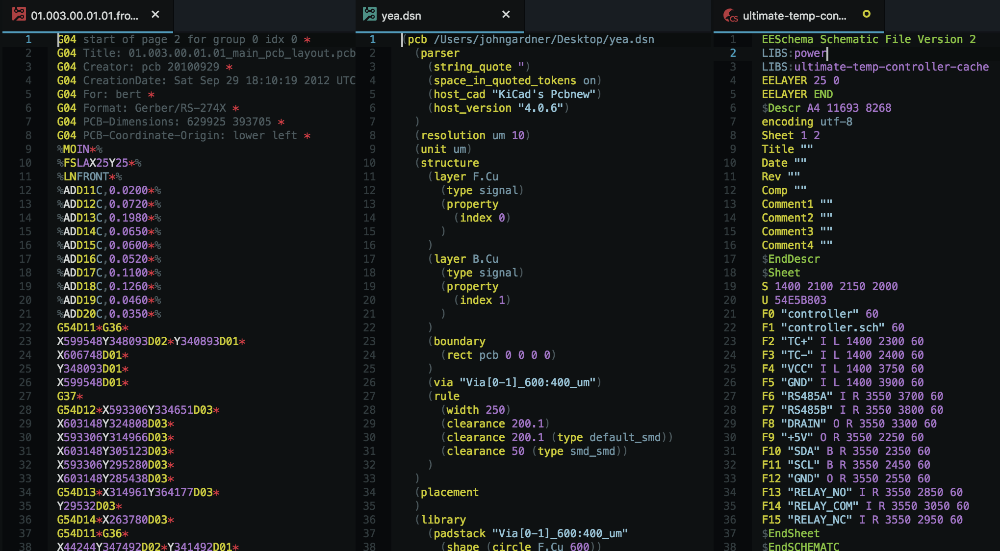

PCB Languages
=============

Syntax highlighting for various [PCB][1] (Printed Circuit Board) formats.

Currently included:

* [Gerber Images][2]
* [KiCad PCB Boards][3]
* [KiCad PCB Schematics][3]
* [KiCad PCB Layouts][3]
* [LTSpice Symbols][8]

Stuff that could be included:

* [OrCAD `.dsn` files][4]
* [Excellon drills][5]
* [G-Code][6]
* Whatever [`pcb`][7] uses as its native format:

~~~ini
# release: pcb 4.0.1
PCB["" 6000.00mil 5000.00mil]
Symbol['!' 12.00mil]
(
	SymbolLine[0.0000 45.00mil 0.0000 50.00mil 8.00mil]
	SymbolLine[0.0000 10.00mil 0.0000 35.00mil 8.00mil]
)
# To read pcb files, the pcb version (or the git source date) must be >= the file version
FileVersion[20091103]
Grid[10.00mil 0.0000 0.0000 0]
Flags("nameonpcb,uniquename,clearnew,snappin")
~~~

[Referenced links]:_____________________________________________________________
[1]: https://en.wikipedia.org/wiki/Printed_circuit_board
[2]: https://www.ucamco.com/files/downloads/file/81/the_gerber_file_format_specification.pdf
[3]: http://bazaar.launchpad.net/~stambaughw/kicad/doc-read-only/download/head:/1115%4016bec504-3128-0410-b3e8-8e38c2123bca:trunk%252Fkicad-doc%252Fdoc%252Fhelp%252Ffile_formats%252Ffile_formats.pdf/file_formats.pdf
[4]: https://fileinfo.com/extension/dsn
[5]: http://www.artwork.com/gerber/drl2laser/excellon/index.htm
[6]: http://www.johnjohnson.info/wp-content/uploads/2013/05/pcbgcode.pdf
[7]: http://pcb.geda-project.org/
[8]: http://www.zen22142.zen.co.uk/ltspice/newsymbols.htm
